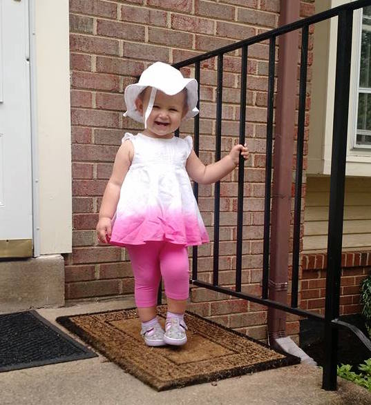
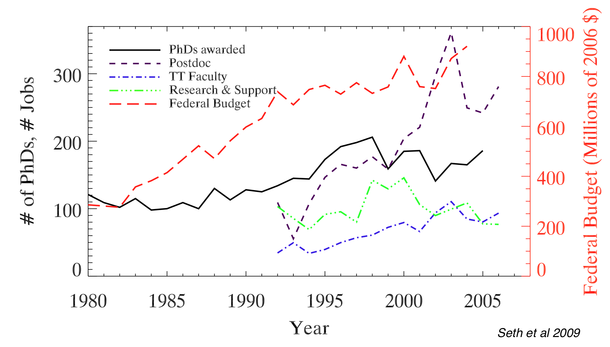
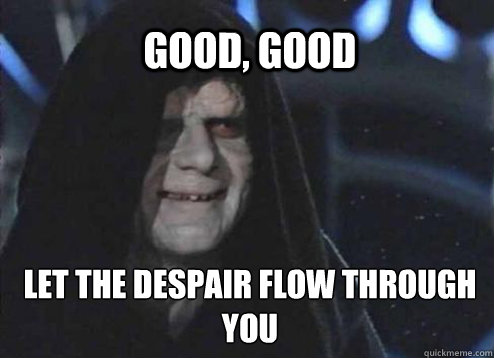
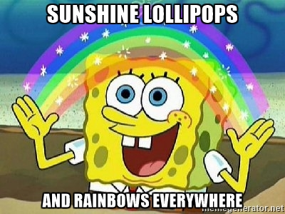
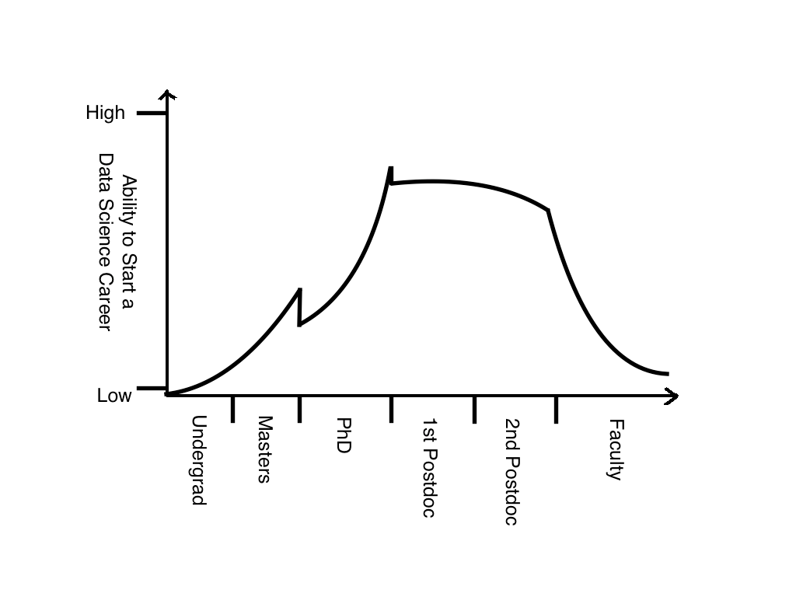

<!-- .slide: data-background="images/bliss.png" -->

#Getting Out <!-- .element: class="title-1"-->
###One Astronomer's Journey from the Ivory Tower to Greener Pastures <!-- .element: class="title-3"-->

---
<!-- .slide: data-background="#383838" -->

#whoami
* PhD Astronomy, UW-Madison, December 2013
* Data Scientist at Capital One
* [Part time NFL analyst](https://phdfootball.blogspot.com/), cooking enthusiast, dad

<!-- .slide: data-background="#383838" -->

---

#Outline
* The academic job market
* Compare and contrast: PhD and data science
* Advice for job-seekers
* Advice for mentors

---
<!-- .slide: data-background="#E74C3C" -->

#Real Talk

---

##The Astronomy Job Market Sucks

<!-- .element: class="fragment" data-fragment-index="1" -->

##For the "Lucky" Ones
* 5-7 years of grad school <!-- .element: class="fragment" data-fragment-index="1" -->
* 2-3 years of postdoc <!-- .element: class="fragment" data-fragment-index="2" --> *(lather, rinse repeat)* <!-- .element: class="fragment" data-fragment-index="3" -->
* 5-7 years on tenure track <!-- .element: class="fragment" data-fragment-index="4" -->
* <!-- .element: class="fragment" data-fragment-index="5" -->*almost no control over where you live*

##Your Day-to-Day as a Faculty Member
* Write grant applications
* Teach courses
* Mentor students
* Serve on Committees
* *Notice I didn't mention "do research"*

##Other Options
* Liberal Arts School
  * Less pressure to get grants and publish
  * Heavy focus on teaching and mentoring undergrads
* Research Labs
  * Focus on doing research
  * Infrequent mentorship/teaching opportunities
  * Relatively rare
* Soft Money
  * Totally free to do what you want
  * Totally at the mercy of the grant cycle

---

---

##Other, *Other* Options
* <!-- .element: class="fragment grow highlight-red" data-fragment-index="2" -->Data Science
* Public Policy
* Education and Outreach
* Aerospace
* Project Management
* <!-- .element: class="fragment" data-fragment-index="1" -->Others

---
<!-- .slide: data-background="#D4AC0D" -->

#My Life, Then & Now

##Work-Life Balance
* Then
  * Pressure to work long hours
  * Few boundaries
  * Set your own schedule
* Now
  * Nobody expects more than 40 hours per week
  * People are surprised when you respond to emails on weekends
  * Some expectation for a schedule resembling a 9-5

##Day-to-Day
* Then
  * Work on big-picture problems with far-off deadlines
  * Couple of meetings per week
* Now
  * Lots of smaller deadlines on short timescales
  * 2-5 meetings per day

##Tools
* Then
  * Python/Bash scripts, small C++ programs, some PHP
  * Smattering of shared memory parallelization and distributed computing
  * Plots, powerpoint, papers
* Now
  * Python packages (modules, unit tests, code reviews, style standards, automated documentation)
  * Hadoop
  * Interactive data visualization
  * AWS/Devops

##Perks
* Then
  * Set your own schedule
  * Occasional free lunch
* Now
  * Money (salary and 401(k) matching + bonus + stock)
  * Location
  * Laptop + cell phone
  * t-shirts + other swag
  * Corporate travel
  * Occasional free lunch

##Projects
* Then
  * Vague constraints
  * Limited oversight
  * End goal: publish paper
* Now
  * Deadlines
  * Project Management
  * End goal: build something that affects the lives of millions of people

---
<!-- .slide: data-background="#1ABC9C" -->

#Getting into Data Science

---

##Timing Matters

