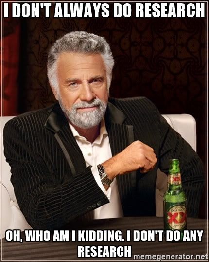
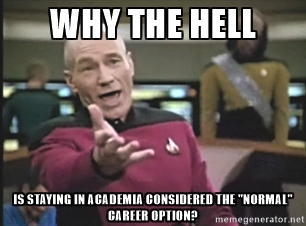
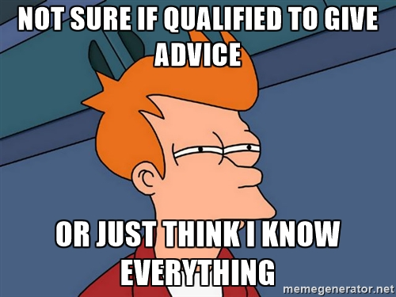
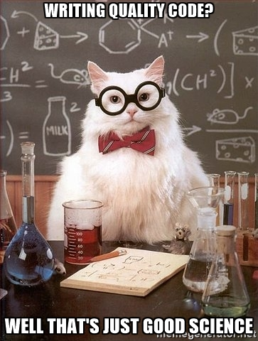

<!-- .slide: data-background="images/bliss.png" -->

#Getting Out <!-- .element: class="title-1"-->
###True Tales of Life Outside the Ivory Tower and How You Can Live There Too <!-- .element: class="title-3"-->
###Andrew Schechtman-Rook, PhD <!-- .element: class="title-3"-->
####<!-- .element: class="fragment" data-fragment-index="1" --> <a href="https://andrewrook.github.io/getting_out/#/">andrewrook.github.io/getting_out</a>

<!-- .slide: data-background="images/there_and_back_again.jpg" -->

<!-- .slide: data-background="images/data_science_good.jpg" -->
##The Andrew Schechtman-Rook Lecture for Astronomers Who Want to Data Science Good <!-- .element: class="title-2"-->
###And Who Wanna Learn to Do Other Stuff Good Too <!-- .element: class="title-3"-->

---
<!-- .slide: data-background="#383838" -->

#whoami
* <!-- .element: class="fragment" data-fragment-index="1" --> PhD Astronomy, UW-Madison, December 2013
* <!-- .element: class="fragment" data-fragment-index="2" --> Data Scientist at Capital One
* <!-- .element: class="fragment" data-fragment-index="3" -->[Part time NFL analyst](https://phdfootball.blogspot.com/), cooking enthusiast, dad

<!-- .slide: data-background="#383838" -->

---

#Outline
* The academic job market
* Compare and contrast: PhD and data science
* Advice for job-seekers
* Advice for mentors
* Advice for departments

---
<!-- .slide: data-background="#E74C3C" -->

#Real Talk

---

#The Astronomy Job Market Sucks

##For the "Lucky" Ones
* 5-7 years of grad school <!-- .element: class="fragment" data-fragment-index="1" -->
* 2-3 years of postdoc <!-- .element: class="fragment" data-fragment-index="2" -->
* <!-- .element: style="color:black" --> 5-7 years on tenure track

##For the "Lucky" Ones
* 5-7 years of grad school
* ~~2-3~~ 5-9 years of postdoc
* 5-7 years on tenure track <!-- .element: class="fragment" data-fragment-index="1" -->

##Have a Nice Trip

###Your Day-to-Day as a Faculty Member
* Write grant applications <!-- .element: class="fragment" data-fragment-index="1" -->
* Teach courses <!-- .element: class="fragment" data-fragment-index="1" -->
* Mentor students <!-- .element: class="fragment" data-fragment-index="1" -->
* Serve on Committees <!-- .element: class="fragment" data-fragment-index="1" -->

##Other Options
* Liberal Arts School <!-- .element: class="fragment" data-fragment-index="1" -->
  * Less pressure to get grants and publish <!-- .element: class="fragment" data-fragment-index="2" -->
  * Heavy focus on teaching and mentoring undergrads <!-- .element: class="fragment" data-fragment-index="3" -->
* Research Labs <!-- .element: class="fragment" data-fragment-index="4" -->
  * Focus on doing research <!-- .element: class="fragment" data-fragment-index="5" -->
  * Infrequent mentorship/teaching opportunities <!-- .element: class="fragment" data-fragment-index="6" -->
  * Relatively rare <!-- .element: class="fragment" data-fragment-index="7" -->
* Soft Money <!-- .element: class="fragment" data-fragment-index="8" -->
  * Totally free to do what you want <!-- .element: class="fragment" data-fragment-index="9" -->
  * Totally at the mercy of the grant cycle <!-- .element: class="fragment" data-fragment-index="10" -->

---

---

##Other, *Other* Options
* Data Science <!-- .element: class="fragment" data-fragment-index="1" -->
* Public Policy <!-- .element: class="fragment" data-fragment-index="2" -->
* Education and Outreach <!-- .element: class="fragment" data-fragment-index="2" -->
* Aerospace <!-- .element: class="fragment" data-fragment-index="2" -->
* Project Management <!-- .element: class="fragment" data-fragment-index="2" -->
* <!-- .element: class="fragment" data-fragment-index="3" -->...and then some

---
<!-- .slide: data-background="#D4AC0D" -->

#My Life, Then & Now

##Work-Life Balance
* Then <!-- .element: class="fragment" data-fragment-index="1" -->
  * Pressure to work long hours <!-- .element: class="fragment" data-fragment-index="1" -->
  * Few boundaries <!-- .element: class="fragment" data-fragment-index="2" -->
  * Set your own schedule <!-- .element: class="fragment" data-fragment-index="3" -->
* Now <!-- .element: class="fragment" data-fragment-index="4" -->
  * Nobody expects more than 40 hours per week <!-- .element: class="fragment" data-fragment-index="4" -->
  * People are surprised when I respond to emails on weekends <!-- .element: class="fragment" data-fragment-index="5" -->
  * Some expectation for a schedule resembling a 9-5 <!-- .element: class="fragment" data-fragment-index="6" -->

##Day-to-Day
* Then <!-- .element: class="fragment" data-fragment-index="1" -->
  * Work on big-picture problems with far-off deadlines <!-- .element: class="fragment" data-fragment-index="1" -->
  * Couple of meetings per week <!-- .element: class="fragment" data-fragment-index="2" -->
* Now <!-- .element: class="fragment" data-fragment-index="3" -->
  * Lots of smaller deadlines on short timescales <!-- .element: class="fragment" data-fragment-index="3" -->
  * 2-5 meetings per day <!-- .element: class="fragment" data-fragment-index="4" -->

##Tools
* Then <!-- .element: class="fragment" data-fragment-index="1" -->
  * Python/Bash scripts, small C++ programs, some PHP <!-- .element: class="fragment" data-fragment-index="1" -->
  * Smattering of shared memory parallelization and distributed computing <!-- .element: class="fragment" data-fragment-index="2" -->
  * Plots, powerpoint, papers <!-- .element: class="fragment" data-fragment-index="3" -->
* Now <!-- .element: class="fragment" data-fragment-index="4" -->
  * Python packages (modules, unit tests, code reviews, style standards, automated documentation) <!-- .element: class="fragment" data-fragment-index="4" -->
  * Git and GitHub <!-- .element: class="fragment" data-fragment-index="5" -->
  * Hadoop <!-- .element: class="fragment" data-fragment-index="6" -->
  * Interactive data visualization <!-- .element: class="fragment" data-fragment-index="7" -->
  * AWS/Devops <!-- .element: class="fragment" data-fragment-index="8" -->

##Perks
* Then <!-- .element: class="fragment" data-fragment-index="1" -->
  * Set my own schedule <!-- .element: class="fragment" data-fragment-index="1" -->
  * Occasional free lunch <!-- .element: class="fragment" data-fragment-index="2" -->
* Now <!-- .element: class="fragment" data-fragment-index="3" -->
  * Jobs in places I want to work <!-- .element: class="fragment" data-fragment-index="3" -->
  * Salary commensurate with my skills and education <!-- .element: class="fragment" data-fragment-index="4" -->
  * Corporate swag <!-- .element: class="fragment" data-fragment-index="5" -->
  * Occasional free lunch <!-- .element: class="fragment" data-fragment-index="6" -->

##Projects
* Then <!-- .element: class="fragment" data-fragment-index="1" -->
  * Vague constraints <!-- .element: class="fragment" data-fragment-index="1" -->
  * Limited oversight <!-- .element: class="fragment" data-fragment-index="2" -->
  * End goal: publish paper <!-- .element: class="fragment" data-fragment-index="3" -->
* Now <!-- .element: class="fragment" data-fragment-index="4" -->
  * Deadlines <!-- .element: class="fragment" data-fragment-index="4" -->
  * Project Management <!-- .element: class="fragment" data-fragment-index="5" -->
  * End goal: build something that affects the lives of millions of people <!-- .element: class="fragment" data-fragment-index="6" -->

---
<!-- .slide: data-background="#1ABC9C" -->

#Advice for Job-Seekers

---

#General Advice

###Leaving Academia is **NOT** Failing

###Leaving Academia is **NOT** Failing
* Unless you totally ignore the possibility of leaving until you're forced out<!-- .element: class="fragment" data-fragment-index="1" -->

###Have a Back Up Plan

###Have a Back Up Plan
* The sooner, the better<!-- .element: class="fragment" data-fragment-index="1" -->
* <!-- .element: class="fragment" data-fragment-index="2" -->Make it concrete and actionable
* <!-- .element: style="color:black" -->this is placeholder text to left alighn the list. it doesn't have any useful content in it.

###Internships

###Internships
* ...exist!<!-- .element: class="fragment" data-fragment-index="1" -->
* <!-- .element: class="fragment" data-fragment-index="2" -->Will show you whether a field is right for you as well as what skills you'll need to thrive in it
* <!-- .element: class="fragment" data-fragment-index="3" -->Grease the skids of a job hunt

###Conferences

##Conferences
* <!-- .element: class="fragment" data-fragment-index="1" --> Data Science: <a href="https://conference.scipy.org/">Scipy</a>, <a href="http://pydata.org/">PyData</a>, <a href="http://conferences.oreilly.com/strata">Strata</a>, <a href="https://www.r-project.org/conferences.html">useR</a>, <a href="http://conf.turi.com/">Data Science Summit</a>
* <!-- .element: class="fragment" data-fragment-index="2" --> Public Policy: <a href="http://www.aaas.org/page/forum-science-technology-policy">AAAS</a>, <a href="http://www.atlantaconference.org/">Atlanta Conference</a>
* Google is your friend<!-- .element: class="fragment" data-fragment-index="3" -->

###Talk to People

###Talk to People
* Informational interviews are super helpful <!-- .element: class="fragment" data-fragment-index="1" -->
* Don't be afraid to cold-email people<!-- .element: class="fragment" data-fragment-index="2" -->
* Ask to see resumes<!-- .element: class="fragment" data-fragment-index="3" -->

Note: In case anyone hasn't heard of this, it's going and chatting with people in careers you're interested in, not explicitly to get a job but more for understanding what they do, how they got there, and what skills they look for in job candidates. It seems intimidating to essentially beg strangers for their time, but almost everyone is glad to do it. Why? 1: people like helping people (and talking about themselves). 2: You build their network as they build yours. 3: Referral bonuses are a real thing.

---

#For Data Science

##Your code is your craft
* <!-- .element: class="fragment" data-fragment-index="1" --> Use OSS
* <!-- .element: class="fragment" data-fragment-index="2" --> Write the best code you can
* <!-- .element: class="fragment" data-fragment-index="3" --> Use modern version control
* <!-- .element: style="color:black" -->this is placeholder text to left alighn the list. it doesn't have any useful content in it.

##Choose your projects carefully
* <!-- .element: class="fragment" data-fragment-index="1" --> Build tools for others
* <!-- .element: class="fragment" data-fragment-index="2" --> Use parallel/distributed computing
* <!-- .element: class="fragment" data-fragment-index="3" --> Work on large datasets
* <!-- .element: class="fragment" data-fragment-index="4" --> Employ machine learning techniques 
* <!-- .element: style="color:black" -->this is placeholder text to left alighn the list. it doesn't have any useful content in it.

##Get practice on the side
* <!-- .element: class="fragment" data-fragment-index="1" --> Passion projects
* <!-- .element: class="fragment" data-fragment-index="2" --> Kaggle contests
* <!-- .element: class="fragment" data-fragment-index="3" -->[Always be learning](http://duu86o6n09pv.cloudfront.net/reports/2015-data-science-salary-survey.pdf)
* <!-- .element: style="color:black" -->this is placeholder text to left alighn the list. it doesn't have any useful content in it.

##Timing matters
* <!-- .element: class="fragment" data-fragment-index="1" -->...but isn't everything
* <!-- .element: class="fragment" data-fragment-index="2" --> Be prepared to explain why you're changing careers

---
<!-- .slide: data-background="#D35400" -->

#Advice for Mentors

###What Is Your Plan B?

###What Is Your Plan B?
* Ask about it on Day 1
* <!-- .element: class="fragment" data-fragment-index="1" --> Demand they come up with something coherent and well thought-out
* <!-- .element: class="fragment" data-fragment-index="2" --> Work with them to figure out how to prepare for it

###Recognize That This Should Be Normal

###Recognize That This Should Be Normal
* Getting a job in academia is the unusual outcome
* <!-- .element: class="fragment" data-fragment-index="1" --> There's a huge amount of luck involved

###Find Help

###Find Help
* You're probably not qualified to give specific advice
* <!-- .element: class="fragment" data-fragment-index="1" --> Work your network to find connections who are

---
<!-- .slide: data-background="#8E44AD" -->

#Advice for Departments

###Up Your Coding Game

###Up Your Coding Game
* Add more opportunities for students to learn programming
* <!-- .element: class="fragment" data-fragment-index="1" --> Get a departmental GitHub membership

###De-Stigmatize Non-Academic Careers

###De-Stigmatize Non-Academic Careers
* Keep in better contact with alumni outside of astronomy
* <!-- .element: class="fragment" data-fragment-index="1" --> Talk openly with students about options outside of academia
* <!-- .element: class="fragment" data-fragment-index="2" --> Bring in more speakers to talk about non-academic career paths

###Institutionalize Changes

###Institutionalize Changes
* Hire faculty who are prominent in the open source community
* <!-- .element: class="fragment" data-fragment-index="1" --> Discourage grad students from doing a Physics minor
* <!-- .element: class="fragment" data-fragment-index="2" --> Add career discussions to Committee of 3 meetings, thesis proposals, and other grad student/faculty check-ins
* <!-- .element: class="fragment" data-fragment-index="3" --> Put detailed implementation guidelines for addressing non-academic career paths in the Strategic Plan

##Rationale

* Better coding makes *everything* better
  * Enable robust and repeatable analysis <!-- .element: class="fragment" data-fragment-index="1" -->
  * Realize that dream of having the new student pick up right where the old student left off <!-- .element: class="fragment" data-fragment-index="2" -->
  * Make collaboration as frictionless as possible <!-- .element: class="fragment" data-fragment-index="3" -->
  * Prepare students for success both inside and outside academia <!-- .element: class="fragment" data-fragment-index="4" -->

* Embracing this head-on will pay dividends
  * Students will feel better supported, more confident, and happier <!-- .element: class="fragment" data-fragment-index="1" -->
  * We'll attract more and better students to our graduate program <!-- .element: class="fragment" data-fragment-index="2" -->
  * Alumni will donate time, expertise, and money <!-- .element: class="fragment" data-fragment-index="3" -->

* The problem is going to get worse, not better
  * No signs of any positive change in job market <!-- .element: class="fragment" data-fragment-index="1" -->
  * "Fixing" the market without encouraging alternative careers would almost certainly mean taking on many fewer graduate students and postdocs <!-- .element: class="fragment" data-fragment-index="2" -->

Note: And if we have 50-75% fewer postdocs and grad students, who's going to be able to maintain a robust research program?

---

##The Time to Make These Changes is Now
* We're hurting everyone by sticking our heads in the sand <!-- .element: class="fragment" data-fragment-index="1" -->
* The community would laud our efforts <!-- .element: class="fragment" data-fragment-index="2" -->
* We'd have a huge first-mover advantage <!-- .element: class="fragment" data-fragment-index="3" -->

Note: because this problem is so obvious to everyone but nobody is really doing anything concrete yet it would be easy to get publicity and recognition, similar to how creating the family and emergency leave policy got us invited to speak in special sessions at the AAS. 

---
<!-- .slide: data-background="#3498DB" -->

#Questions?
#Let's Chat!

