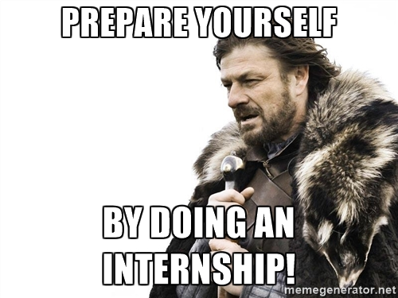

<!-- .slide: data-background="images/bliss.png" -->

#Getting Out <!-- .element: class="title-1"-->
###One Astronomer's Journey from the Ivory Tower to Greener Pastures <!-- .element: class="title-3"-->
####<!-- .element: class="fragment" data-fragment-index="1" --> <a href="https://andrewrook.github.io/getting_out/#/">andrewrook.github.io/getting_out</a>

---
<!-- .slide: data-background="#383838" -->

#whoami
* <!-- .element: class="fragment" data-fragment-index="1" --> PhD Astronomy, UW-Madison, December 2013
* <!-- .element: class="fragment" data-fragment-index="1" --> Data Scientist at Capital One
* <!-- .element: class="fragment" data-fragment-index="1" -->[Part time NFL analyst](https://phdfootball.blogspot.com/), cooking enthusiast, dad

<!-- .slide: data-background="#383838" -->

---

#Outline
* The academic job market
* Compare and contrast: PhD and data science
* Advice for job-seekers
* Advice for mentors

---
<!-- .slide: data-background="#E74C3C" -->

#Real Talk

---

#The Astronomy Job Market Sucks

##For the "Lucky" Ones
* 5-7 years of grad school <!-- .element: class="fragment" data-fragment-index="1" -->
* 2-3 years of postdoc <!-- .element: class="fragment" data-fragment-index="2" -->
* <!-- .element: style="color:black" --> 5-7 years on tenure track

##For the "Lucky" Ones
* 5-7 years of grad school
* 2-3 years of postdoc
* 5-7 years on tenure track

##Your Day-to-Day as a Faculty Member
* Write grant applications
* Teach courses
* Mentor students
* Serve on Committees

##Other Options
* Liberal Arts School <!-- .element: class="fragment" data-fragment-index="1" -->
  * Less pressure to get grants and publish <!-- .element: class="fragment" data-fragment-index="2" -->
  * Heavy focus on teaching and mentoring undergrads <!-- .element: class="fragment" data-fragment-index="3" -->
* Research Labs <!-- .element: class="fragment" data-fragment-index="4" -->
  * Focus on doing research <!-- .element: class="fragment" data-fragment-index="5" -->
  * Infrequent mentorship/teaching opportunities <!-- .element: class="fragment" data-fragment-index="6" -->
  * Relatively rare <!-- .element: class="fragment" data-fragment-index="7" -->
* Soft Money <!-- .element: class="fragment" data-fragment-index="8" -->
  * Totally free to do what you want <!-- .element: class="fragment" data-fragment-index="9" -->
  * Totally at the mercy of the grant cycle <!-- .element: class="fragment" data-fragment-index="10" -->

---

---

##Other, *Other* Options
* Data Science <!-- .element: class="fragment" data-fragment-index="1" -->
* Public Policy <!-- .element: class="fragment" data-fragment-index="2" -->
* Education and Outreach <!-- .element: class="fragment" data-fragment-index="2" -->
* Aerospace <!-- .element: class="fragment" data-fragment-index="2" -->
* Project Management <!-- .element: class="fragment" data-fragment-index="2" -->
* <!-- .element: class="fragment" data-fragment-index="3" -->...and then some

---
<!-- .slide: data-background="#D4AC0D" -->

#My Life, Then & Now

##Work-Life Balance
* Then <!-- .element: class="fragment" data-fragment-index="1" -->
  * Pressure to work long hours <!-- .element: class="fragment" data-fragment-index="1" -->
  * Few boundaries <!-- .element: class="fragment" data-fragment-index="2" -->
  * Set your own schedule <!-- .element: class="fragment" data-fragment-index="3" -->
* Now <!-- .element: class="fragment" data-fragment-index="4" -->
  * Nobody expects more than 40 hours per week <!-- .element: class="fragment" data-fragment-index="4" -->
  * People are surprised when I respond to emails on weekends <!-- .element: class="fragment" data-fragment-index="5" -->
  * Some expectation for a schedule resembling a 9-5 <!-- .element: class="fragment" data-fragment-index="6" -->

##Day-to-Day
* Then <!-- .element: class="fragment" data-fragment-index="1" -->
  * Work on big-picture problems with far-off deadlines <!-- .element: class="fragment" data-fragment-index="1" -->
  * Couple of meetings per week <!-- .element: class="fragment" data-fragment-index="2" -->
* Now <!-- .element: class="fragment" data-fragment-index="3" -->
  * Lots of smaller deadlines on short timescales <!-- .element: class="fragment" data-fragment-index="3" -->
  * 2-5 meetings per day <!-- .element: class="fragment" data-fragment-index="4" -->

##Tools
* Then <!-- .element: class="fragment" data-fragment-index="1" -->
  * Python/Bash scripts, small C++ programs, some PHP <!-- .element: class="fragment" data-fragment-index="1" -->
  * Smattering of shared memory parallelization and distributed computing <!-- .element: class="fragment" data-fragment-index="2" -->
  * Plots, powerpoint, papers <!-- .element: class="fragment" data-fragment-index="3" -->
* Now <!-- .element: class="fragment" data-fragment-index="4" -->
  * Python packages (modules, unit tests, code reviews, style standards, automated documentation) <!-- .element: class="fragment" data-fragment-index="4" -->
  * Git and GitHub <!-- .element: class="fragment" data-fragment-index="5" -->
  * Hadoop <!-- .element: class="fragment" data-fragment-index="6" -->
  * Interactive data visualization <!-- .element: class="fragment" data-fragment-index="7" -->
  * AWS/Devops <!-- .element: class="fragment" data-fragment-index="8" -->

##Perks
* Then <!-- .element: class="fragment" data-fragment-index="1" -->
  * Set my own schedule <!-- .element: class="fragment" data-fragment-index="1" -->
  * Occasional free lunch <!-- .element: class="fragment" data-fragment-index="2" -->
* Now <!-- .element: class="fragment" data-fragment-index="3" -->
  * Jobs in places I want to work <!-- .element: class="fragment" data-fragment-index="3" -->
  * Salary commensurate with my skills and education <!-- .element: class="fragment" data-fragment-index="4" -->
  * Corporate swag <!-- .element: class="fragment" data-fragment-index="5" -->
  * Occasional free lunch <!-- .element: class="fragment" data-fragment-index="6" -->

##Projects
* Then <!-- .element: class="fragment" data-fragment-index="1" -->
  * Vague constraints <!-- .element: class="fragment" data-fragment-index="1" -->
  * Limited oversight <!-- .element: class="fragment" data-fragment-index="2" -->
  * End goal: publish paper <!-- .element: class="fragment" data-fragment-index="3" -->
* Now <!-- .element: class="fragment" data-fragment-index="4" -->
  * Deadlines <!-- .element: class="fragment" data-fragment-index="4" -->
  * Project Management <!-- .element: class="fragment" data-fragment-index="5" -->
  * End goal: build something that affects the lives of millions of people <!-- .element: class="fragment" data-fragment-index="6" -->

---
<!-- .slide: data-background="#1ABC9C" -->

#Advice for Job-Seekers

---

#General Advice

* Leaving academia is not failing
  * <!-- .element: class="fragment" data-fragment-index="1" -->Unless you totally ignore the possibility of leaving until you're forced out

* Have a back up plan
  * <!-- .element: class="fragment" data-fragment-index="1" -->The sooner, the better
  * <!-- .element: class="fragment" data-fragment-index="2" -->Start acting on it 

* Internships
   * <!-- .element: class="fragment" data-fragment-index="1" -->...exist!
   * <!-- .element: class="fragment" data-fragment-index="2" -->Will show you whether a field is right for you as well as what skills you'll need to thrive in it
   * <!-- .element: class="fragment" data-fragment-index="3" -->Grease the skids of a job hunt
   
---

#For Data Science

* Your code is your craft
  * <!-- .element: class="fragment" data-fragment-index="1" --> Use OSS
  * <!-- .element: class="fragment" data-fragment-index="2" --> Write the best code you can
  * <!-- .element: class="fragment" data-fragment-index="3" --> Use modern version control

* Choose your projects carefully
  * <!-- .element: class="fragment" data-fragment-index="1" --> Build tools for others
  * <!-- .element: class="fragment" data-fragment-index="2" --> Use parallel/distributed computing
  * <!-- .element: class="fragment" data-fragment-index="3" --> Work on large datasets
  * <!-- .element: class="fragment" data-fragment-index="4" --> Employ machine learning techniques beyond linear regression

* Get practice on the side
  * <!-- .element: class="fragment" data-fragment-index="1" --> Passion projects
  * <!-- .element: class="fragment" data-fragment-index="2" --> Kaggle contests
  * <!-- .element: class="fragment" data-fragment-index="3" -->[Always be learning](http://duu86o6n09pv.cloudfront.net/reports/2015-data-science-salary-survey.pdf)

* Timing matters
  * <!-- .element: class="fragment" data-fragment-index="1" -->...but isn't everything
  * <!-- .element: class="fragment" data-fragment-index="2" --> Be prepared to explain why you're changing careers

---
<!-- .slide: data-background="#D35400" -->

#Advice for Mentors

* Day 1, ask "what is your Plan B?"
  * <!-- .element: class="fragment" data-fragment-index="1" --> Demand they come up with something coherent and well thought-out
  * <!-- .element: class="fragment" data-fragment-index="2" --> Work with them to figure out how to prepare for it.

* Recognize that this should be normal
  * <!-- .element: class="fragment" data-fragment-index="1" --> Getting a job in academia is the unusual outcome.
  * <!-- .element: class="fragment" data-fragment-index="2" --> There's a huge amount of luck involved

* Find help
  * <!-- .element: class="fragment" data-fragment-index="1" --> You're probably not qualified to give specific advice
  * <!-- .element: class="fragment" data-fragment-index="2" --> Work your network to find connections who are

---
<!-- .slide: data-background="#3498DB" -->

#Questions? Let's Chat!

